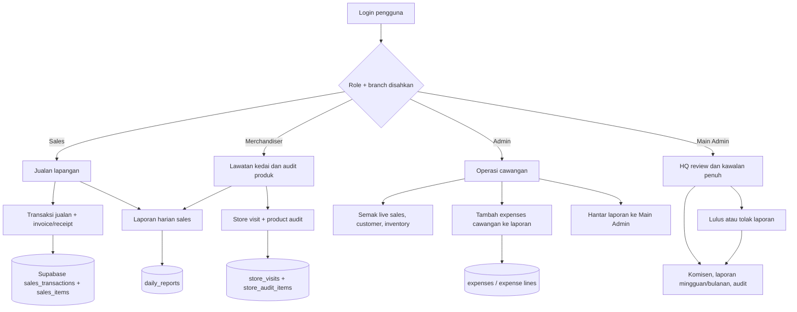
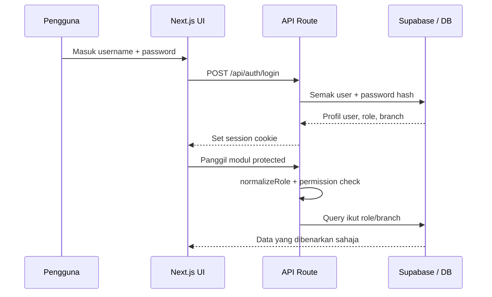
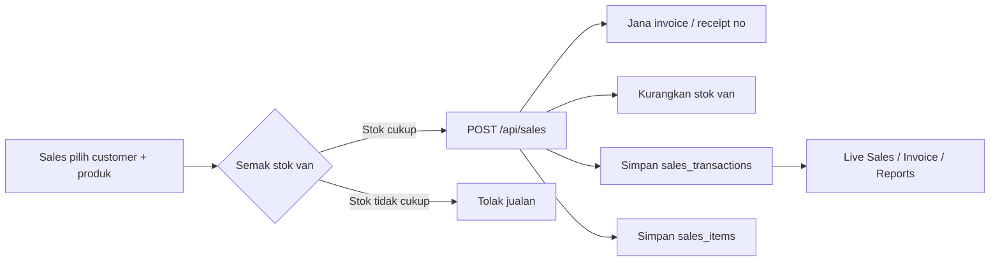
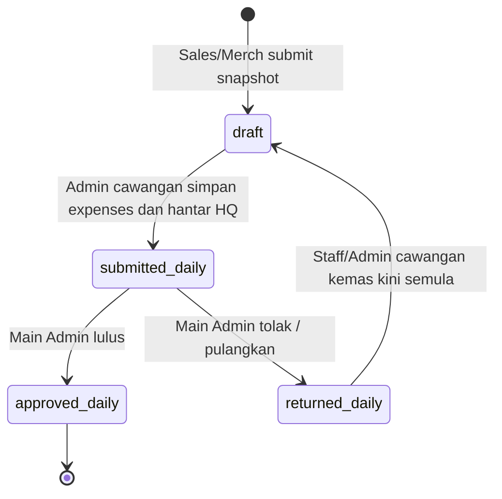
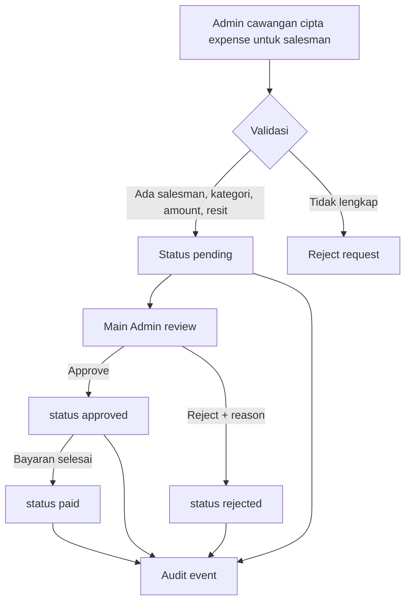
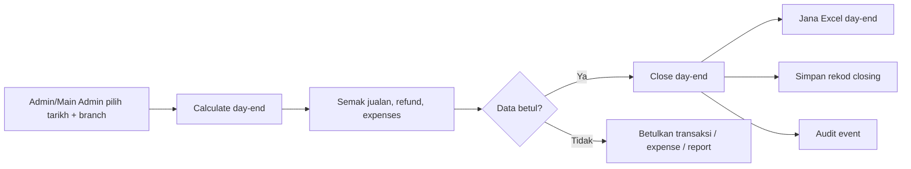
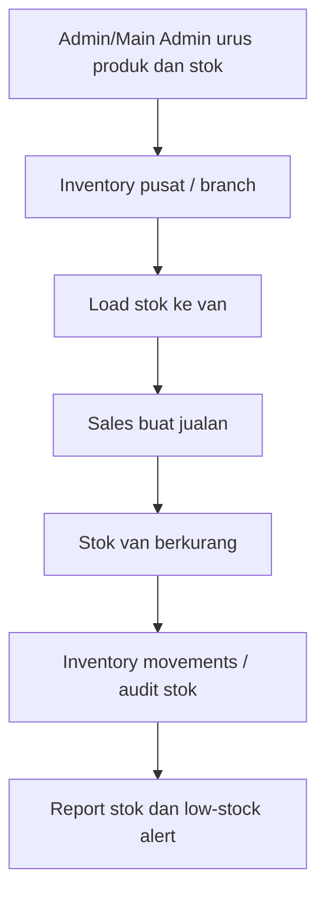
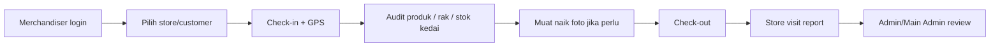
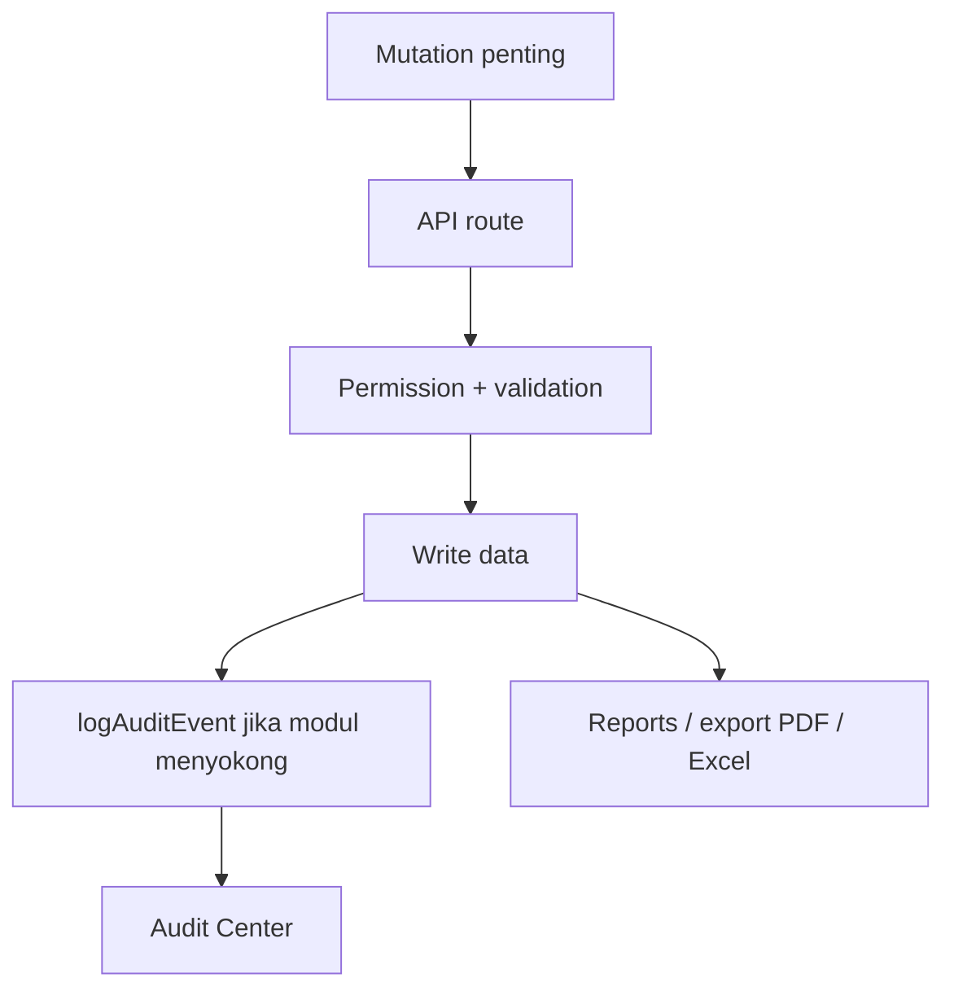

# Pelan workflow sistem SAYS 2.0

Dokumen ini dibuat selepas semakan repo. Pelan workflow sedia ada yang ditemui ialah
[`docs/void-invoice-workflow-plan.md`](void-invoice-workflow-plan.md), tetapi dokumen itu khusus
untuk aliran void invois/gantian. Dokumen ini pula menerangkan workflow sistem secara menyeluruh
berdasarkan modul dan kod semasa.

---

## 1. Skop sistem

SAYS 2.0 mengurus operasi jualan lapangan, stok, pelanggan, merchandiser, expenses, laporan dan
audit untuk beberapa cawangan. Sumber data utama ialah Supabase/PostgreSQL; Firestore digunakan
sebagai lapisan tambahan untuk fungsi real-time/legacy.

| Peranan | Tanggungjawab utama |
|---|---|
| `Main Admin` | Akses semua cawangan, kelulusan akhir, polisi komisen, audit, laporan HQ |
| `Admin` | Operasi cawangan: semak jualan, pelanggan, stok, expenses cawangan, hantar laporan ke HQ |
| `Sales` | Buat jualan, invois/resit, laporan harian jualan sendiri |
| `Merchandiser` | Lawatan kedai, audit produk, laporan lawatan |

---

## 2. Workflow sistem tahap tinggi

---

## 3. Aliran login, akses dan data

Prinsip penting:

- `Main Admin` boleh lihat dan urus semua cawangan.
- `Admin` dikunci kepada cawangan sendiri untuk data operasi.
- `Sales` hanya lihat transaksi/laporan sendiri.
- Mutation penting perlu melalui API route dan direkod dalam audit jika modul menyokongnya.

---

## 4. Workflow jualan dan invois

Peraturan kerja:

1. Sales buat jualan melalui `/sales`.
2. Sistem jana nombor invoice/receipt dan rekod transaksi di `sales_transactions`.
3. Item jualan disimpan di `sales_items`.
4. Stok van dikemaskini selepas jualan berjaya.
5. Admin/Main Admin boleh semak melalui Live Sales, invoices dan reports.
6. Pembatalan/void invoice ikut dokumen khusus:
   [`docs/void-invoice-workflow-plan.md`](void-invoice-workflow-plan.md).

---

## 5. Workflow laporan harian

Status utama dalam kod:

Aliran operasi:

| Langkah | Siapa | Sistem / route | Hasil |
|---|---|---|---|
| 1 | Sales/Merchandiser | `/api/daily-reports` `POST` | Laporan harian disimpan sebagai `draft` |
| 2 | Admin cawangan | `/admin/reports` | Semak laporan ikut branch |
| 3 | Admin cawangan | `save_branch_report` | Isi expenses, bukti bank/cash, resit |
| 4 | Admin cawangan | `submit_stage` | Status menjadi `submitted_daily` |
| 5 | Main Admin | `approve_stage` atau `return_stage` | Status menjadi `approved_daily` atau `returned_daily` |
| 6 | Sistem | Reports hub | Summary harian/mingguan hanya kira laporan yang diluluskan |

Nota:

- Butang "Hantar ke Main Admin" hanya aktif selepas expenses/bukti disimpan ke laporan.
- Jika Main Admin tolak, `returnedReason` disimpan dan `branchExpensesSyncedAt` dikosongkan supaya
  cawangan perlu semak semula sebelum hantar balik.
- Kad summary di Reports Hub menggunakan `approved_daily`, bukan semua live sales mentah.

---

## 6. Workflow expenses

Peraturan kerja:

- Sales tidak boleh cipta expense sendiri melalui API.
- Admin cawangan hanya boleh cipta expense untuk salesman dalam cawangan sendiri.
- Main Admin sahaja boleh `approve`, `reject` atau `mark paid`.
- Resit adalah wajib untuk rekod expense.

---

## 7. Workflow day-end closing

Day-end mengambil data jualan, item jualan, refund dan expenses yang berkaitan untuk tarikh/cawangan.
Selepas close, sistem menyimpan rekod closing dan cuba menjana fail Excel di storage.

---

## 8. Workflow inventory dan stok

Peraturan kerja:

- Produk dan stok diurus oleh Admin/Main Admin.
- Jualan yang berjaya mengurangkan stok van.
- Rekod movement digunakan untuk audit perubahan stok.
- Untuk proses void, stok perlu dipulihkan mengikut pelan void invoice.

---

## 9. Workflow merchandiser

Data utama:

- `store_visits` untuk rekod lawatan.
- `store_audit_items` untuk audit produk per lawatan.
- Akses store ikut branch/assignment yang dibenarkan.

---

## 10. Workflow audit dan laporan

Modul laporan utama:

| Modul | Fungsi |
|---|---|
| Live Sales | Pantau transaksi jualan semasa |
| Daily Reports | Workflow draft, pending, lulus, tolak |
| Weekly Reports | Ringkasan mingguan dan export |
| Monthly Reports | Ringkasan bulanan / closing bulanan |
| Audit Center | Jejak tindakan penting |
| Day End | Closing harian dan export Excel |

---

## 11. Matriks status penting

| Domain | Status | Maksud |
|---|---|---|
| Daily report | `draft` | Menunggu admin cawangan lengkapkan dan hantar |
| Daily report | `submitted_daily` | Menunggu Main Admin |
| Daily report | `approved_daily` | Diluluskan dan boleh masuk summary |
| Daily report | `returned_daily` | Dipulangkan untuk pembetulan |
| Expense | `pending` | Menunggu Main Admin |
| Expense | `approved` | Diluluskan |
| Expense | `rejected` | Ditolak dengan sebab |
| Expense | `paid` | Sudah dibayar |
| Sales void | `voided_at IS NOT NULL` | Transaksi dibatalkan dari revenue aktif |

---

## 12. Fail rujukan utama

| Fail | Tujuan |
|---|---|
| `README.md` | Ringkasan sistem, roles, modul utama |
| `ARCHITECTURE_OVERVIEW.md` | Architecture dan data flow |
| `PROJECT_STRUCTURE.md` | Struktur folder, routes, API |
| `docs/void-invoice-workflow-plan.md` | Pelan khusus void invoice |
| `app/api/sales/route.ts` | Create/list sales |
| `app/api/daily-reports/route.ts` | Daily report workflow |
| `components/features/admin/AdminReportsHub.tsx` | UI workflow laporan admin |
| `components/features/admin/DailyReportDataTable.tsx` | Status dan tindakan laporan |
| `app/api/expenses/route.ts` | Expense create/approve/reject/paid |
| `app/api/day-end/close/route.ts` | Day-end closing |
| `lib/permissions.ts` | Permission/RBAC helper |

---

## 13. Cadangan penggunaan dokumen

1. Guna dokumen ini untuk tunjuk aliran sistem kepada owner/client.
2. Guna `void-invoice-workflow-plan.md` apabila bincang isu invoice salah/void/gantian.
3. Jika ada perubahan proses bisnes, kemas kini dahulu bahagian status dan swimlane sebelum ubah kod.
4. Untuk UAT, semak satu workflow penuh: Sales submit daily report -> Admin cawangan isi expenses
   -> hantar HQ -> Main Admin approve/return -> summary berubah.
