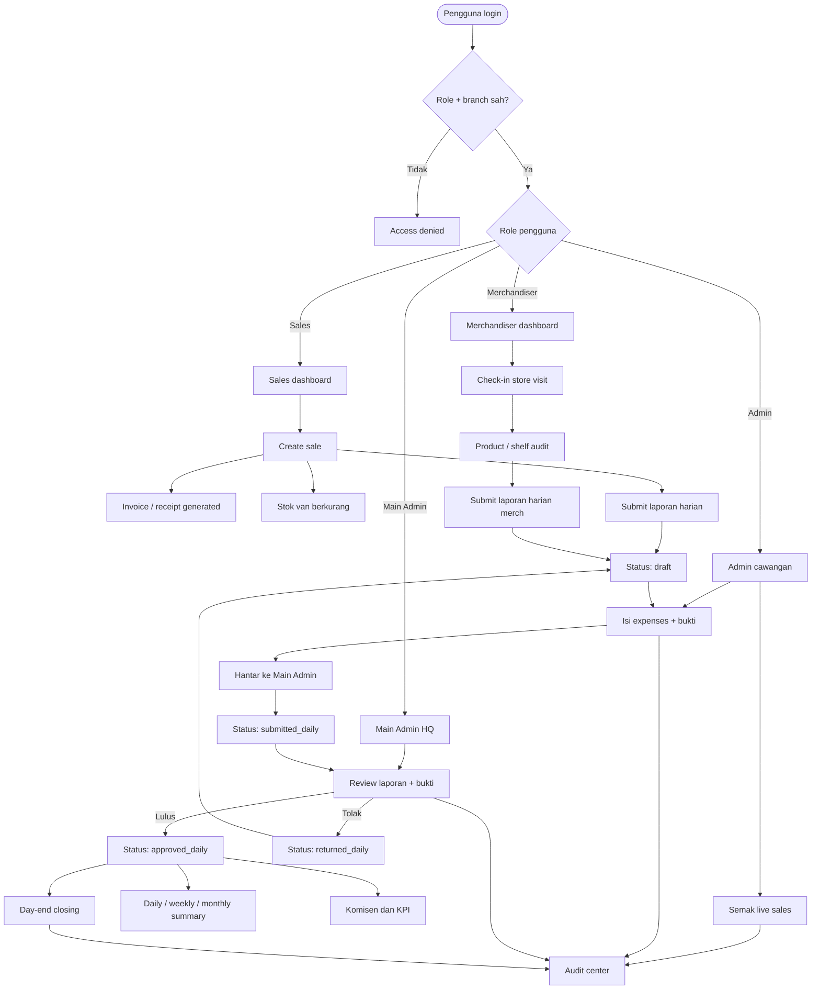
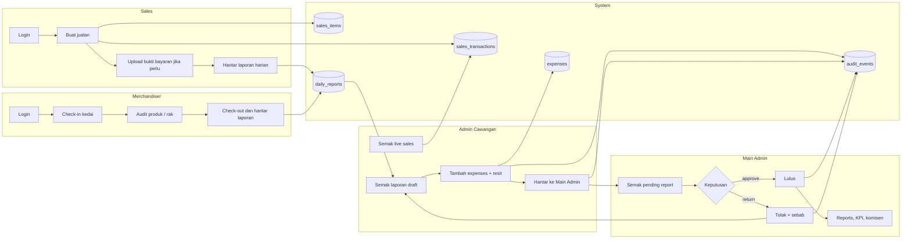
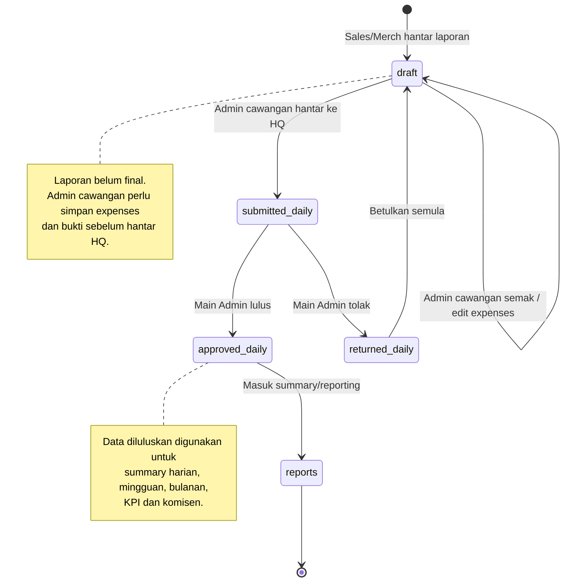
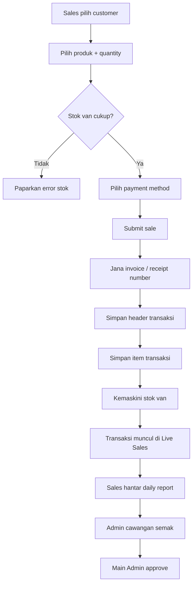
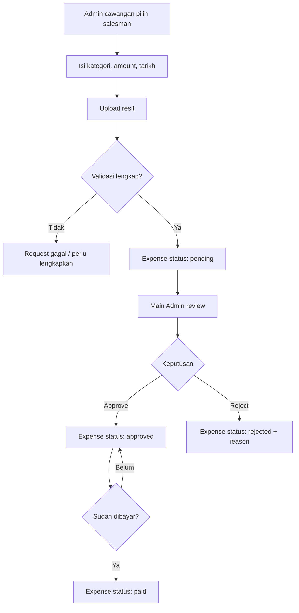
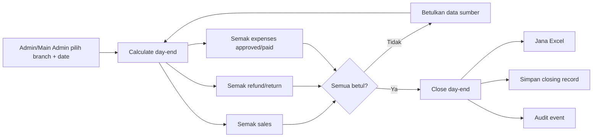
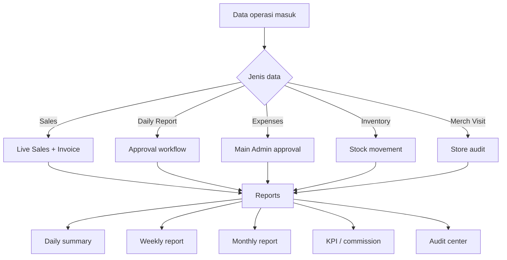

# Visual planning workflow SAYS 2.0

Dokumen ini versi visual untuk menerangkan planning workflow sistem kepada owner/client. Diagram
ditulis dalam Mermaid supaya GitHub boleh render sebagai carta.

Rujukan detail teknikal: [`system-workflow-plan.md`](system-workflow-plan.md).

---

## 1. Big picture workflow

---

## 2. Swimlane mengikut role

---

## 3. Status workflow laporan harian

---

## 4. Workflow jualan sampai laporan

---

## 5. Workflow expenses dan kelulusan

---

## 6. Workflow day-end

---

## 7. Ringkasan keputusan workflow

---

## Cara tunjuk kepada client

1. Mulakan dengan **Big picture workflow** untuk gambaran semua peranan.
2. Guna **Swimlane mengikut role** untuk jelaskan siapa buat apa.
3. Guna **Status workflow laporan harian** untuk tunjuk approval flow sebenar.
4. Guna diagram jualan, expenses dan day-end jika client tanya modul tertentu.
