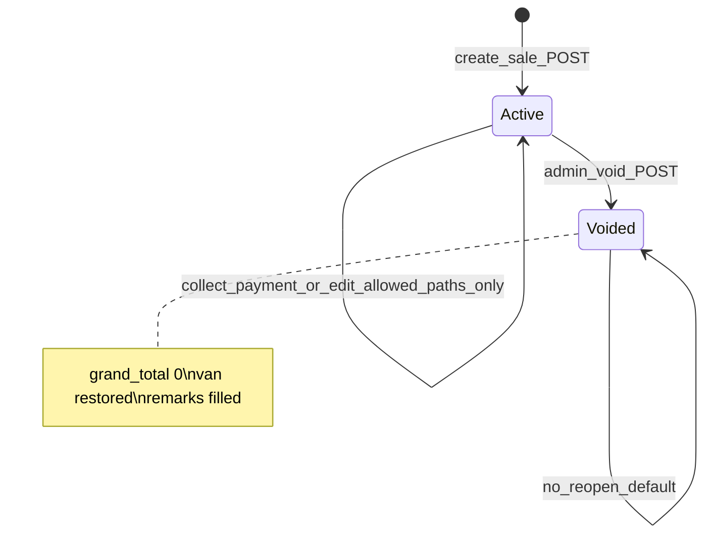
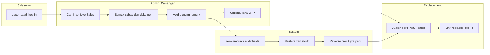
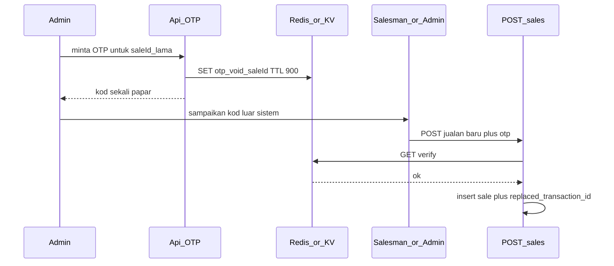

# Pelan kerja: Void invois, gantian, OTP, laporan & KPI

Dokumen ini menyatukan keperluan client/akauntan dengan struktur kod sedia ada (`sales_transactions`, Live Sales, komisen, laporan harian). Matlamat: **aliran yang kemas**, **audit trail penuh**, dan **penghantaran berperingkat** tanpa meneka semula peraturan perniagaan.

---

## 1. Prinsip reka bentuk (tidak boleh dilanggar)

| Prinsip | Implementasi |
|--------|----------------|
| Tiada padam transaksi | Rekod kekal; pembatalan = **status + nilai kewangan sifar** + timestamp + remark |
| Satu punca benar untuk “jualan aktif” | API laporan/komisen/Live Sales **tapis keluar** `voided` secara lalai; parameter eksplisit untuk audit |
| Jurujual tidak membatalkan sendiri | Tiada endpoint/button void untuk peranan `Sales`; hanya **Admin / Main Admin** (ikut [`canAccessSalesRoutes`](lib/permissions.ts) + semakan tambahan) |
| Invoi gantian ialah transaksi baharu | Nombor invois baharu melalui [`lib/invoiceNumbers.ts`](lib/invoiceNumbers.ts); **pautan** `replaces_transaction_id` / `replacement_transaction_id` dua hala |
| Kredit & stok konsisten | Void mesti **pulihkan stok van** (simetri [`POST /api/sales`](app/api/sales/route.ts)) dan **songsangkan kesan `bill_to_bill`** pada baki pelanggan ([`collect-payment`](app/api/sales/collect-payment/route.ts)) |

---

## 2. Definisi istilah

- **Transaksi aktif:** `voided_at IS NULL` dan nilai yang digunakan dalam KPI adalah nilai semasa (atau `grand_total` selepas void = 0 untuk rekod dibatalkan — ditakrifkan dalam Fasa A).
- **Void:** Tindakan admin yang mengunci rekod sebagai dibatalkan dari sudut **hasil/revenue**; invoi masih boleh dicetak semula dengan label “DIBATALKAN”.
- **Invoi gantian:** Satu baris baharu dalam `sales_transactions` dengan jumlah betul; dipaut ke invoi lama.
- **OTP (optional):** Kod sekali guna berTTL pendek (Redis/KV sedia ada) — **bukan** pengganti kelulusan admin; ia mengikat **tindakan tertentu** (contoh: sahkan pembukaan borang invoi gantian atau sahkan void).

---

## 3. Mesin keadaan transaksi (jelas untuk pasukan)

**Peraturan:** Tiada transisi `Voided → Active`. Pembetulan selepas void = **rekod baharu** (invoi gantian).

---

## 4. Aliran operasi (swimlane) — versi “paling kemas” untuk client

Ini gambaran **disyorkan** yang menggabungkan semua titik client: maklum admin → semak → void → (optional OTP) → invoi baharu → KPI.

**Urutan masa nyata:**

1. Jurujual beritahu admin (saluran sedia ada — WhatsApp). Tiada butang cancel untuk jurujual dalam sistem (peraturan client).
2. **Admin cawangan** buka **Live Sales**, tapis **cawangan + jurujual + tarikh**, jumpa invois.
3. Admin semak sebab; jika tidak sah, **tidak** void — komunikasi luar sistem.
4. Admin tekan **Batalkan invois** → borang: `void_remarks` (wajib), optional `internal_note`.
5. Sistem jalankan **transaksi logik satu blok**: kemas kini DB + pulih stok + songsang kredit.
6. **Invoi baharu:** jurujual atau admin cawangan cipta jualan seperti biasa; pada payload atau langkah kedua, **paut** ke ID transaksi lama (medan `replaced_transaction_id`).
7. **OTP (jika diaktifkan):** Admin klik “Jana OTP untuk invoi gantian” → kod dipaparkan / dihantar manual → jurujual masukkan pada borang jualan baharu atau admin sahkan dalam modal void — konfigurasi diputuskan dalam Fasa OTP (lihat bahagian 8).

---

## 5. Model data (cadangan tepat)

Semua pada **`sales_transactions`** melainkan dinyatakan lain.

| Medan | Jenis | Keterangan |
|-------|--------|------------|
| `voided_at` | timestamptz, nullable | Ada nilai = dibatalkan |
| `voided_by` | uuid/text | FK ke `users` jika konsisten |
| `void_remarks` | text | Paparan akauntan / audit |
| `original_grand_total` | numeric, nullable | **Isi sekali** pada saat void (snapshot `grand_total` sebelum sifar) — penting untuk KPI “nilai dibatalkan” |
| `original_subtotal_amount` | optional | Jika laporan perlu pecahan |
| `replacement_transaction_id` | uuid, nullable | Anak kepada transaksi gantian |
| `replaced_transaction_id` | uuid, nullable | Pada rekod **baharu**: rujuk ID void |

**`status` sedia ada:** kekal serasi; boleh set `voided` atau kekalkan `completed` + guna `voided_at` sebagai sumber benar — **pilih satu strategi** dalam migration untuk elak dua kebenaran.

**`sales_items`:** Kekal untuk audit; jumlah pada header transaksi di sifar semasa void (baris item boleh kekal sebagai snapshot atau disalin ke JSON — keputusan prestasi).

---

## 6. Permukaan API (ringkas)

| Kaedah | Laluan | Peranan | Fungsi |
|--------|--------|---------|--------|
| POST | `/api/sales/[id]/void` | Admin, Main Admin | Batalkan: body `{ remarks, otp? }` |
| POST | `/api/sales/void-requests/otp` | Admin | Jana OTP (optional) |
| POST | `/api/sales` | Sales, Admin | Sedia ada + medan optional `replaced_transaction_id` + `replacement_otp?` |
| GET | `/api/sales` | — | Query `includeVoided`, `onlyVoided` untuk audit/KPI |

Semua mutation **log** melalui [`logAuditEvent`](lib/audit.ts) dengan `entityType` dan ID invois.

---

## 7. Penapis & integrasi dengan kod sedia ada

### 7.1 GET `/api/sales` ([`app/api/sales/route.ts`](app/api/sales/route.ts))

- Lalai: **exclude** `voided_at IS NOT NULL` daripada senarai “operasi”.
- Admin audit: `includeVoided=true`.

### 7.2 Komisen ([`app/api/commissions/route.ts`](app/api/commissions/route.ts))

- Hari ini: jumlah semua jualan mengikut pengguna untuk tempoh.
- **Wajib:** tolak transaksi dengan `voided_at` set **atau** `grand_total === 0` dengan flag void (elak double-count).
- **Perhatian teknikal:** kod semasa menapis `salesman_id` — padanan dengan medan sebenar dalam DB (`user_id` vs `salesman_id`) perlu **disahkan semasa pembinaan** supaya komisen tidak terlepas atau terhinggap.

### 7.3 Laporan harian jurujual ([`app/sales/daily-report/page.tsx`](app/sales/daily-report/page.tsx))

- Snapshot pada masa hantar adalah **sejarah beku**.
- **MVP berhemat:** footer/nota pada PDF/UI: “Transaksi dibatalkan selepas tarikh laporan tidak mengubah cetakan ini — rujuk pentadbir.”
- **Tahap penuh:** jadual `void_adjustments` atau medan pada `daily_reports` — **anggar masa lebih besar**.

---

## 8. OTP — aliran yang disyorkan (pilihan produk)

**Matlamat OTP:** memastikan **invoi gantian** atau **void** tidak dilakukan tanpa kod yang dikeluarkan selepas semakan admin.

**Tanpa SMS pada MVP:** OTP dipaparkan kepada admin untuk disampaikan (WhatsApp). SMS boleh ditambah kemudian tanpa ubah model void.

---

## 9. KPI (definisi yang jelas)

| Metrik | Formula cadangan | Penapis |
|--------|------------------|---------|
| Bilangan void | `COUNT(*)` dengan `voided_at` dalam julat | cawangan, jurujual (`user_id`) |
| Nilai dibatalkan | `SUM(original_grand_total)` | sama |
| Kadar silap | void_count / jumlah transaksi aktif (tempoh sama) | optional |

Paparan: tab baharu di Live Sales atau halaman Reports sedia ada — **bersihkan** dari double-count komisen.

---

## 10. Penghantaran berperingkat & kriteria terima

| Fasa | Skop | Terima jika |
|------|------|-------------|
| **MVP-1** | Migration medan + void API + van + penapis GET sales | Void tidak muncul dalam jumlah harian lalai; stok van betul |
| **MVP-2** | UI Live Sales (batalkan + badge) + audit log | Admin boleh lengkapkan tanpa akses DB |
| **MVP-3** | Kredit `bill_to_bill` songsang + ujian baki | Akauntan sahkan baki selepas void |
| **MVP-4** | Pautan invoi gantian + optional OTP | Aliran client terpenuhi dengan dokumentasi skrin |
| **MVP-5** | KPI dashboard | Nombor sepadan dengan DB |

---

## 11. Risiko & mitigasi

| Risiko | Mitigasi |
|--------|----------|
| Lomba dua admin void serentak | Semakan optimistik / unique partial index pada `voided_at` + retry |
| Komisen sudah dibayar untuk jualan yang kemudian void | Proses akauntan luar sistem atau laporan “clawback” — dokumentasi |
| Snapshot laporan harian vs realiti | Nota MVP + fasa penambahbaikan jika client mahukan ubah sejarah |

---

## 12. Fail kod utama untuk sentuh (rujukan pembinaan)

- [`app/api/sales/route.ts`](app/api/sales/route.ts) — POST jualan, GET penapis
- [`components/features/admin/LiveSalesHistory.tsx`](components/features/admin/LiveSalesHistory.tsx) — UI senarai
- [`app/admin/live-sales/page.tsx`](app/admin/live-sales/page.tsx) — konteks halaman
- [`migrations/`](migrations/) — migration baharu mengikut corak fail sedia ada

---

## 13. Keputusan lalai (supaya pelan “terbaik” tanpa tunggu mesyuarat)

1. **Sumber benar void:** `voided_at IS NOT NULL` (bukan hanya `grand_total = 0`).
2. **Simpan `original_grand_total` pada masa void** untuk KPI dan audit.
3. **OTP** sebagai fasa berasingan selepas void + UI stabil.
4. **Tiada jadual `void_requests` pada MVP** — komunikasi luar sistem; jika mahu tiket dalam app, tambah sebagai penambahbaikan.

---

*Dokumen ini boleh dikemas kini apabila keputusan client berubah (contoh: Main Admin sah vs Admin cawangan sah untuk void).*
